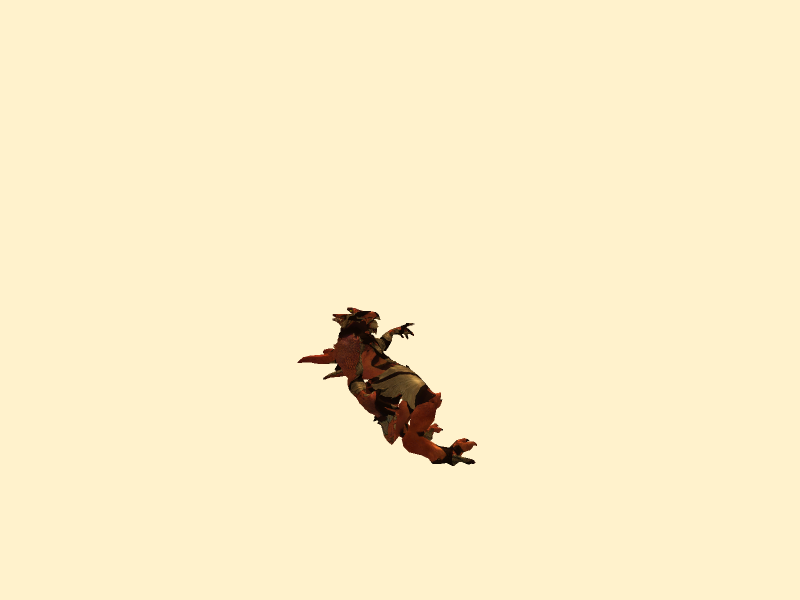

# CGI 第一次作业（渲染部分）：

孙海岳 2100013127


## Task1 卡通风格
Cel Shading算法

定义：卡通渲染（英语：Cel-shading或者Toon Shading）是一种去真实感的渲染方法，旨在使电脑生成的图像呈现出手绘般的效果。为了使图像可以与漫画或者卡通达到形似的效果，专业人员通常使用卡通渲染着色器进行处理。

作业的实现思路是，通过认为设定颜色层次，使得在不同光照强度下颜色有显著的分层现象，从而形成一种非真实感渲染。具体效果如下，就卡通特点而言，具体可以观察球体高光处出现的那种一圈一圈的现象。


关于实现方法，首先就色差而言，实际上是人为定义了一个映射关系，将连续的色彩映射到一个不连续的色彩空间中。具体的实现在problem2.h中：
```C++
Color Rendering::Toon(Color col, const Vector4 &loc, const Vector4 &Norm){
    // problem 2.2: 10%
    // 在此处填写你的代码：

    // A: 点光源的高光
    float Ida;
    Vector4 light_dira = loc - light.dLightpos[0]; // 入射光方向
    double fatta = 1 / light_dira.Magnitude() * light_dira.Magnitude(); // 光衰减
    light_dira.normalize();
    Vector4 reflect_dira = 2 * Norm * Dot3(-light_dira, Norm) + light_dira;
    Vector4 camera_dir = camera.eyePos - loc;
    camera_dir.normalize();
    double cos_phi = Dot3(camera_dir, reflect_dira) / (camera_dir.Magnitude() * reflect_dira.Magnitude());
    cos_phi = Clamp(cos_phi, 0.0, 1.0);
    Ida = fatta * light.ks * pow(cos_phi, light.ns);
    Color Highlight = Ida * Color::white();

    // B: 点光源的漫反射
    float Idb;
    Vector4 light_dirb = loc - light.dLightpos[0]; // 入射光方向
    double fattb = 1 / light_dirb.Magnitude() * light_dirb.Magnitude(); // 光衰减
    light_dirb.normalize();
    double cos_thetab = Dot3(-light_dirb, Norm) / (light_dirb.Magnitude() * Norm.Magnitude());
    cos_thetab = Clamp(cos_thetab, 0.0, 1.0);
    Idb = fattb * light.kd * cos_thetab;

    // C: 平行光源的漫反射
    float Idc;
    Vector4 light_dirc = -light.pLightdirect[0]; // 入射光方向
    light_dirc.normalize();
    double cos_thetac = Dot3(-light_dirc, Norm) / (light_dirc.Magnitude() * Norm.Magnitude());
    cos_thetac = Clamp(cos_thetac, 0.0, 1.0);
    Idc = light.kd  * cos_thetac;

    // D: 强度为 light.ka 的环境光。
    float Idd;
    Idd = light.ka;

    float diffuse = Idb + Idc + Idd;
    if (diffuse > 0.8) {
        diffuse = 1.0;
    }
    else if (diffuse > 0.5) {
        diffuse = 0.6;
    }
    else if (diffuse > 0.2) {
        diffuse = 0.4;
    }
    else {
        diffuse = 0.2;
    }

    if (Ida > 0.8) {
        Ida = 1.0;
    }
    else if (Ida > 0.5) {
        Ida = 0.6;
    }
    else if (Ida > 0.2) {
        Ida = 0.4;
    }
    else {
        Ida = 0.2;
    }
    Highlight = Ida * Color::white();
    col = diffuse * col + Highlight;
    return col;
}
```
最底下的部分便是离散映射的部分。此外为了使之更具有艺术风格（类似于mhy那样的），在渲染过程中添加了描边，具体实现的思路是，在渲染好一幅图像后，再对这副图像重新进行描边，即在背景色中，选取哪些距离前景距离小于delta的像素描黑，从而形成描边效果，具体实现在rendering.h的drawScene函数中，紧跟在drawmodel完毕之后，其中delta是可以指定的描边宽度：
```C++
if (renderType == 1)
{
    double** newcolorbuf;
    newcolorbuf = new double*[2 * _h];
    double* ttptr = new double[4 * _w * _h];
    ttptr = new double[12 * _w * _h];
    for (int i = 0; i < 2 * _h; i++)
        newcolorbuf[i] = ttptr + 6 * i * _w;
    // 添加描边
    float delta = 6; // delta 在这！！！！！！！
    for(int x = 0; x < 2*_h; ++ x)
    {
        for(int y = 0; y < 2* _w; ++y)
        {

            double* ptr = colorbuf[x] + 3 * y;
            Color col;
            col.z = *(ptr + 0);
            col.y = *(ptr + 1);
            col.x = *(ptr + 2);
            bool check = true;
            if(col.x == defaultColor.x 
                && col.y == defaultColor.y 
                && col.z == defaultColor.z)
            {
                
                for(int tx = x - delta; tx < x + delta; ++ tx)
                {
                    for(int ty = y - delta; ty < y + delta; ++ty)
                    {
                        
                        if(tx < 0 || ty < 0 || tx >= 2*_h || ty >=2*_w)
                        {
                            continue;
                        }
                        if(sqrt((x - tx) * (x - tx) + (y - ty) * (y - ty)) < delta)
                        {
                            Color tcol;
                            double* tptr = colorbuf[tx] + 3 * ty;
                            tcol.z = *(tptr + 0);
                            tcol.y = *(tptr + 1);
                            tcol.x = *(tptr + 2);
                            if(tcol.x != defaultColor.x || 
                                tcol.y != defaultColor.y || 
                                tcol.z != defaultColor.z)
                            {
                                double* colptr = newcolorbuf[x] + 3 * y;
                                *(colptr + 0) = 0;
                                *(colptr + 1) = 0;
                                *(colptr + 2) = 0;
                                check = false;
                                break;
                            }
                        }
                    }
                    if(!check)
                    {
                        break;
                    }
                }

            }
            if(check)
            {
                double* colptr = newcolorbuf[x] + 3 * y;
                *(colptr + 0) = col.z;
                *(colptr + 1) = col.y;
                *(colptr + 2) = col.x;
            }
        }
    }
    colorbuf = newcolorbuf;
    std::cout << "Finisheeee\n";
}
```

## task2 Ray Tracing简易版

原先的渲染框架中，并没有体现阴影，所以在原先框架中添加射线判定，从而形成阴影是最简易的方式，但是这种方式实际上并不是RayTracing，因为RayTracing实际上包含了光线采样、光线的反射、折射等。作业可以理解为光线完全被吸收，且只采样一次的结果。

这一部分添加了大量代码，主要集中在rendering.h中。

关于光线与三角面交的代码在rendering.h的class Triangle的intersect函数中:
```C++
bool intersect(Ray &ray, float&  t , double EPSILON=1e-5) {
    // 光线与三角面片是否相交
    Vector3 a = V4to3(vertices[0].pos);
    Vector3 b = V4to3(vertices[1].pos);
    Vector3 c = V4to3(vertices[2].pos);
    bool isIn = false;
    Vector3 E1 = b - a;
    Vector3 E2 = c - a;
    Vector3 S = ray.pos - a;
    Vector3 S1 = Cross(ray.dir, E2);
    Vector3 S2 = Cross(S, E1);  
    // 共同系数
    float coeff = 1.0f / Dot(S1, E1);
    t = coeff * Dot(S2, E2);
    float b1 = coeff * Dot(S1, S);
    float b2 = coeff * Dot(S2, ray.dir);
    if (t >= 0 && b1 >= 0 && b2 >= 0 && (1 - b1 - b2) >= 0)
    {
        isIn = true;
    }

    return isIn;
}
```
理论部分可以看知乎，具体思路是利用叉乘，计算t的值。

有了碰撞，我们就可以检测光线能否到达该点，从而调整渲染策略。我的想法是，因为有三类光：环境光、平行光、点光源，我对此理解为，环境光不做考虑，平行光看作距离无穷远的一个光源、点光源就是点光源。所以我实际上需要判断两种光能否到达一点，具体思路为：从光源到该点处做一条射线，如果碰触到了距离光源更近的三角面，则说明光到不了这里。具体代码在rendering.h的class rendering的drawScanline中的渲染col前：
```C++
else if(renderType == 3)
{
    Ray shadowRay;
    Vector3 pHit = V4to3(loc);
    // 点光源
    int lightType = 0b100;
    bool isShadowed = false;
    Vector3 Raydir = V4to3(light.dLightpos[0]) - pHit;
    float distance = Raydir.Magnitude();
    Raydir.normalize();
    float ttmp = distance;
    shadowRay = Ray(V4to3(light.dLightpos[0]), -1 * Raydir);
    float t = 0;
    for(auto &tri : allTriangle)
    {
        if(tri.intersect(shadowRay, t))
        {
            //
            if(ttmp > t)
            {
                // 被遮挡
                isShadowed = true;
                break;
            }
        }
    }
    if(!isShadowed)
    {
        
        lightType |= 0b10;
    }

    // 平行光
    //初始化
    isShadowed = false;
    Raydir = V4to3(-light.pLightdirect[0]); // 与平行光相反的方向，检测是否有遮挡
    Raydir.normalize();
    ttmp = 1e5; // 设为无穷大的原因是假设平行光是从无穷远传来的。
    shadowRay = Ray(pHit, Raydir); // 从Hit点反向射出，检测是否有碰撞
    t = 0;
    for(auto &tri : allTriangle)
    {
        if(tri.intersect(shadowRay, t))
        {
            if(ttmp > t)
            {
                isShadowed = true;
                break;
            }
        }
    }
    if(!isShadowed)
    {
        lightType |= 1;
    }
    col = BlinnPhong(col, loc, normal, lightType);
}
```
需要说明的是，为了完成光追，所以我直接在Problem2.h的BlinnPhong添加了需要渲染的光线的部分代码，这里的lightType按位存储，共三位分别表示：（环境光|点光源|平行光），为了使其它代码不受影响，默认为0b111。

此外，为了获取全局model的信息，我在rendering.h的class rendering中添加了全局变量allTriangle，该变量在drawScene中初始化为全部的三角面的信息：
```C++
allTriangle.resize(0);
for (const auto& model: scene)
{
    int faceSize = model.faces.size();
    Matrix4 worldMat = model.WorldMat;
    Matrix4 invTransWorldMat = worldMat.Inverted().Transposed();
    for (int i = 0; i < faceSize; i++){
        
        // 进行模型内部的变换 worldMat，计算模型的三维平面下的坐标。
        Triangle tri;
        tri = findTriangle(model, i);

        for (int i = 0; i < 3; i++)
        {
            tri.vertices[i].pos = worldMat * tri.vertices[i].pos; 
            tri.vertices[i].normal = invTransWorldMat * tri.vertices[i].normal;
        }
        // 需要添加一个判断Triangle是否有部分在视域内
        allTriangle.push_back(tri);
    }
}
```

**另一种光追**

在基于框架之外，我实际上还实现了一种光追，就是光追原始的算法，思路为，将相机看作光源，向每个像素的位置放出 n 道射线，采样射线，看看这些射线产生的影响，即这些射线能否经过反射、折射到达光源处，从而获得光照，最后求平均值（这利用了蒙特卡洛积分的思想）。

我的具体实现在rendering.h的class rendering的drawScene中：
```C++
else if(renderType == 2)
{
    allTriangle.resize(0);
    for (const auto& model: scene)
    {
        int faceSize = model.faces.size();
        Matrix4 worldMat = model.WorldMat;
        Matrix4 invTransWorldMat = worldMat.Inverted().Transposed();
        for (int i = 0; i < faceSize; i++){
            
            // 进行模型内部的变换 worldMat，计算模型的三维平面下的坐标。
            Triangle tri;
            tri = findTriangle(model, i);
            for (int i = 0; i < 3; i++)
            {
                tri.vertices[i].pos = worldMat * tri.vertices[i].pos; 
                tri.vertices[i].normal = invTransWorldMat * tri.vertices[i].normal;
            }
            for (int i = 0; i < 3; i++)
                tri.vertices[i].pos = camera.transProject(tri.vertices[i].pos);
            // 需要添加一个判断Triangle是否有部分在视域内
            GetColor(tri, model);
            allTriangle.push_back(tri);
        }
    }
    std::cout << "Start Ray Tracing "<< allTriangle.size() << std::endl;
    for(int i= -_w; i < _w; ++i) // width
    {
        for(int j = -_h; j < _h; ++j) // Height
        {
            Vector3 PrimaryRay = computeRay(i, j);
            Color col = Color(0.0, 0.0, 0.0);
            bool dirty = false;
            for(int s = 0; s < 1; ++s)
            {
                Vector3 tmpdir = PrimaryRay;
                Ray tmpRay = Ray(V4to3(camera.eyePos), tmpdir);
                float t=0, tmin=1e5;
                bool check = false;
                Triangle IntersectTri;
                // std::cout <<"Eye Dir : "<< tmpdir << std:: endl;
                // std::cout << "Eye pos : " << camera.eyePos << std::endl;
                for(auto &tri : allTriangle)
                {
                    if(tri.intersect(tmpRay, t))
                    {
                        if(tmin > t)
                        {
                            tmin = t;
                            IntersectTri = tri;
                        }
                        check = true;
                        dirty = true;
                    }
                }
                
                if(check)
                {
                    // std::cout << "get Intersect"<<std::endl;
                    Ray shadowRay;
                    Vector3 pHit = tmpRay(tmin);
                    // 点光源
                    int lightType = 0b100;
                    bool isShadowed = false;
                    Vector3 Raydir = V4to3(light.dLightpos[0]) - pHit;
                    float distance = Raydir.Magnitude();
                    Raydir.normalize();
                    float ttmp = distance;
                    shadowRay = Ray(pHit, Raydir);
                    t = 0;
                    for(auto &tri : allTriangle)
                    {
                        if(tri.intersect(shadowRay, t))
                        {
                            if(ttmp > t)
                            {
                                // 被遮挡
                                isShadowed = true;
                                break;
                            }

                        }
                    }
                    if(!isShadowed)
                    {
                        lightType |= 0b10;
                    }
                    // 平行光
                    //初始化
                    isShadowed = false;
                    Raydir = V4to3(-light.pLightdirect[0]); // 与平行光相反的方向，检测是否有遮挡
                    Raydir.normalize();
                    ttmp = 1e5; // 设为无穷大的原因是假设平行光是从无穷远传来的。
                    shadowRay = Ray(pHit, Raydir); // 从Hit点反向射出，检测是否有碰撞
                    t = 0;
                    for(auto &tri : allTriangle)
                    {
                        if(tri.intersect(shadowRay, t))
                        {
                            if(ttmp > t)
                            {
                                isShadowed = true;
                                break;
                            }
                        }
                    }
                    if(!isShadowed)
                    {
                        lightType |= 1;
                    }
                    Vector3 normal = InterpolateNormal(pHit, IntersectTri);
                    col += BlinnPhong(InterpolateColor(pHit, IntersectTri), pHit, normal, lightType);
                }
            }

            if(!dirty)
            {
                col = defaultColor;
            }

            drawPixel(i + _w, j + _h, col);
        }
    }
}
```
在这个方法中，我们需要计算相机释放的射线，具体代码在rendering.h的class camera中，我实现了一系列函数，用于计算相机到幕布各个角、幕布中心、幕布范围向量的函数。
这样我们就可以很快的识别哪些面片是可以被我们看到的，哪些不可以。（或许可以用于task3？判断Triangle在视野内？）

但是为什么效果这么差呢？这是因为我没有搞明白框架是如何计算model的法线和texture的，导致后续的渲染过程由于法线算不出来，且很多颜色为nan(?)，所以渲染结果就可以看出有阴影，但是物体本身的渲染是错误的。

## task4 模型加载

模型加载的主要难点在于1.如何理解obj文件。 2.如何理解框架中是如何使用texture的。
对于加载obj文件，我的具体实现在rendering.h的class model中：
```C++
void parseOBJ(const char *filePath) {
    using namespace std;
    float x, y, z;
    string content;
    ifstream fileStream(filePath, std::ios::in);
    string line = "";

    int iNum = 0;//调试
    while (!fileStream.eof()) {    
        getline(fileStream, line);
        if (line.compare(0, 2, "v ") == 0) { // vertex position ("v" case)

            std::stringstream ss(line.erase(0, 1));
            ss >> x; ss >> y; ss >> z; // extract the vertex position values
            vertices.push_back(Vector3(x, y, z));                
        }
        if (line.compare(0, 2, "vt") == 0) { // texture coordinates ("vt" case)
            stringstream ss(line.erase(0, 2));
            ss >> x; ss >> y;// extract texture coordinate values
            // printf("%f %f %f\n", x, y, z);
            textureU.push_back(x);
            textureV.push_back(y);
        }
        if (line.compare(0, 2, "vn") == 0) { // vertex normals ("vn" case)
            stringstream ss(line.erase(0, 2));
            ss >> x; ss >> y; ss >> z; // extract the normal vector values
            vertexNormal.push_back(Vector3(x, y, z));
        }
        if (line.compare(0, 2, "f ") == 0) { 
            // 注意，这里的 f 后面必须加一个空格，因为line.compare(0, 2, "f ")中表示从索引0开始的2个字符，而f不加空格只有一个字符
            string oneCorner, v, t, n;
            stringstream ss(line.erase(0, 2));
            vector<vector<int>> face_pace;
            for (int i = 0; i < 3; i++) {
                getline(ss, oneCorner, ' '); // extract triangle face references
                stringstream oneCornerSS(oneCorner);
                getline(oneCornerSS, v, '/');
                getline(oneCornerSS, t, '/');
                getline(oneCornerSS, n, '/');
                int vertRef = stoi(v) -1; // "stoi" converts string to integer
                int tcRef = stoi(t) -1;
                int normRef = stoi(n) -1;
                face_pace.push_back(vector<int>({vertRef, tcRef, normRef}));
            }
            faces.push_back(face_pace);
        }
        if (line.compare(0, 2, "# ") == 0){
            stringstream ss(line.erase(0, 2));
            ss >> x; ss >> y; ss >> z; // extract the normal vector values
            // printf("%s\n", "test");
        }
    }
}   
```
这里没有什么思路，因为obj文件都是设定好的，但是这里实现了其基本功能，即对vertex的定义、法线的定义、texture U V的定义、面片与其它各个量对应关系的定义。

而对于texture的加载，可以视作如何读取bmp文件，并提取里面的颜色信息。具体代码分别在img_reader.h中实现了bmp的读取，在rendering.h的class Texture中实现了绑定颜色，冰初始化：
```C++
void LoadBmpMap(const string& imgPath){
    Clear();
    printf("ckpt1\n");
    covered = true;
    ImgInfo img = readBitmap(imgPath);
    // printf("ckpt1\n");
    _h = img.bi.biHeight;
    _w = img.bi.biWidth;
    _bit = img.imgData;
    // cout << "size "<<_bit[0].size() << endl;
}
```
img_reader.h中的代码如下:
```C++
typedef struct{
    BITMAPFILEHEADER bf;
    BITMAPINFOHEADER bi;
    vector<vector<uint8_t>> imgData;
}ImgInfo;

//根据图片路径读取Bmp图像，生成ImgInfo对象
ImgInfo readBitmap(string imgPath) {
    ImgInfo imgInfo;
    char* buf;                                              //定义文件读取缓冲区
    char* p;

    FILE* fp;
    fopen_s(&fp, imgPath.c_str(), "rb");
    if (fp == NULL) {
        cout << "Open Fail." << endl;
        exit(0);
    }

    fread(&imgInfo.bf, sizeof(BITMAPFILEHEADER), 1, fp);
    fread(&imgInfo.bi, sizeof(BITMAPINFOHEADER), 1, fp);
    printf("Image Width : %d  Image Height : %d\n", imgInfo.bi.biWidth, imgInfo.bi.biHeight);
    if (imgInfo.bi.biBitCount != 24){
        printf("Don't Support %d Bit BitMap",imgInfo.bi.biBitCount);
        exit(0);
    }

    fseek(fp, imgInfo.bf.bfOffBits, 0);

    buf = (char*)malloc(imgInfo.bi.biWidth * imgInfo.bi.biHeight * 3);
    fread(buf, 1, imgInfo.bi.biWidth * imgInfo.bi.biHeight * 3, fp);

    p = buf;
    // printf("ckpt2\n");
    vector<vector<uint8_t>> imgData;
    for (int y = 0; y < imgInfo.bi.biHeight; y++){
        vector<uint8_t> vRGB;
        for (int x = 0; x < imgInfo.bi.biWidth; x++) {
            uint8_t r, g, b;
            r = *(p++);
            g = *(p++);
            b = *(p++);

            vRGB.push_back(b);     //blue
            vRGB.push_back(g);     //green
            vRGB.push_back(r);     //red

            if (x == imgInfo.bi.biWidth - 1)
            {
                for (int k = 0; k < imgInfo.bi.biWidth % 4; k++) p++;
            }
            
        }
        imgData.push_back(vRGB);
    }
    fclose(fp);
    imgInfo.imgData = imgData;
    return imgInfo;
}
```
然后就是直接在原框架中使用即可。


## 其它：实现了窗口与键盘交互
因为注意到了助教在camera中有提到键盘控制相机的函数，但是没有具体接口？所以在task2中为了便于观察，实现了窗口化且可以键盘交互。

这里用到了opencv库，具体安装方式见后文。

思路为，每次渲染保存图像到tmp.bmp，然后利用opencv展示这张图片在窗口中，如果再获得新的按键信息，则关掉这个窗口，修改相机位置，再重新渲染，再展示新图片。

具体代码在task2.cpp的main中，这里我默认注释掉了，如果要用可以开启一下（记得开启相关头文件和函数，如果不使用这个功能就可以不用安装opencv的库）：
```C++
UpdateWindow();
int ch;
// 键盘调用窗口
while (1){
    if (_kbhit()){//如果有按键按下，则_kbhit()函数返回真
        ch = _getch();//使用_getch()函数获取按下的键值
        cout <<"You Enter : " <<char(ch) << std::endl;
        if (ch == 27){ break; }//当按下ESC时循环，ESC键的键值时27.
        if (ch == int('F')) // 当按下F时，保存当前图片为永久图片
        {
            SaveImage();
        }
        string key;
        key = char(ch);
        // 如果不是退出的话，更新窗口
        device.camera.KeyboardUpd(key);
        device.refresh(Color(1.0, 0.95, 0.8));
        device.drawScene(Scene);
        device.drawScreen();
        SaveImageTmp();
        UpdateWindow();
    }
}
system("pause");
```

## 安装和运行

### 安装Opencv
如果不使用窗口化键盘交互，则可以忽略此过程。

opencv已经编译好的库已经附在文件夹中，请按照以下步骤：
1. clone这个仓库，然后找到build文件夹
2. 找到你的MinGW编译器的文件夹，进入mingw64文件夹
3. 将build文件夹下的bin文件夹的路径加入环境变量
4. 将build文件夹下的include、lib和bin文件夹中的内容合并到mingw64文件夹下的include文件夹和lib文件夹和bin文件夹中去（就直接拷贝就可以）。
5. 安装完成~~~

这里需要说明的是mingw64的版本为x86_64-8.1.0-release-posix-seh-rt_v6-rev0。
为了便于安装，我把这个压缩文件也附在文件夹中，解压即可。

### 运行

```bash
g++ task{i}.cpp -o p{i} -O2 -std=c++11;./p{i}
```
如果想要使用窗口交互，需要：
```bash
g++ -g task2.cpp -std=c++14 -I D:\\mingw64\\mingw64\\include -lopencv_core452 -lopencv_imgcodecs452 -lopencv_imgproc452 -lopencv_calib3d452 -lopencv_dnn452 -lopencv_features2d452 -lopencv_flann452 -lopencv_gapi452 -lopencv_highgui452 -lopencv_ml452 -lopencv_objdetect452 -lopencv_photo452 -lopencv_stitching452 -lopencv_video452 -lopencv_videoio452 -o t2;./t2
```
其中"D:\\mingw64\\mingw64\\include"替换为你的mingw的路径